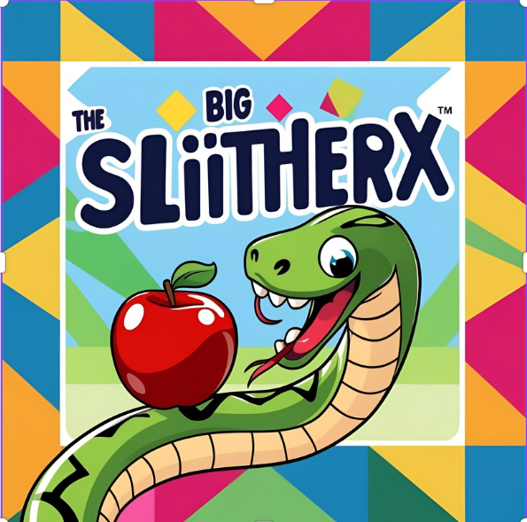

🐍 SlitherX – Classic Snake Game (Java)

SlitherX is a modern take on the classic Snake game built using Java Swing.
Eat food → Grow → Score high — but don’t crash! 🚀
🧠 UML Class Diagram
classDiagram
    class GamePanel {
        - int[] snakeX
        - int[] snakeY
        - int length
        - char direction
        - boolean running
        - Timer timer
        + paint(Graphics)
        + move()
        + checkCollision()
        + checkFood()
        + restart()
    }

    class Main {
        + main(String[] args)
    }

    class Food {
        - int x
        - int y
        + spawn()
        + draw(Graphics)
    }

    GamePanel --> Food : uses
    Main --> GamePanel : creates
🔁 Game Flow Diagram
flowchart TD
    A[Start Game] --> B[Initialize Snake + Food]
    B --> C[User Input Controls Direction]
    C --> D[Snake Moves]
    D --> E{Collision?}
    E -->|Yes| G[Game Over]
    E -->|No| F{Food Eaten?}
    F -->|Yes| H[Increase Length + Score]
    F -->|No| C
    H --> C
    G --> I[Restart Option]
    I -->|Restart| A
    I -->|Quit| J[Exit]
    
🚀 Features
Smooth movement & fast rendering
Score counter updates in real time
Randomized food spawning
Collision detection with boundaries + body
Pure Java OOP implementation

🛠 Tech Stack
| Component | Tech Used     |
| --------- | ------------- |
| Language  | Java 11+      |
| UI        | Swing         |
| IDE       | IntelliJ IDEA |

▶️ Run Instructions
git clone https://github.com/mmahekk/SlitherX.git
cd SlitherX
# Open in IntelliJ and run Main.java

🎯 Controls
| Key | Action     |
| --- | ---------- |
| ⬆   | Move Up    |
| ⬇   | Move Down  |
| ⬅   | Move Left  |
| ➡   | Move Right |

✨ Future Enhancements
🎵 Sound effects
🧱 Walls / Maze mode
🏆 High Score storage
🌈 Themes + Snake skins
📱 Android GUI version (JavaFX or LibGDX)

👩‍💻 Developer: 
Mahek 
🔗 LinkedIn: mmahekk24
📦 GitHub: mmahekk
